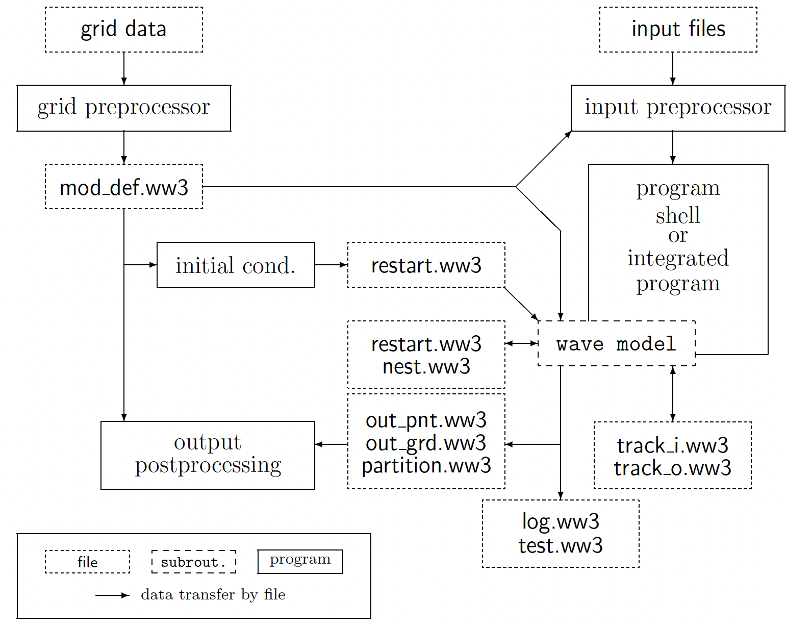

## MOM6-CICE6-WW3 in ACCESS-OM3

### Overview: Traditional vs Coupled Configurations

In the ACCESS-OM3, the traditional configuration includes the ocean model (MOM6) coupled with the sea-ice model (CICE6). Introducing the wave model (WAVEWATCH III, or WW3) as a third component adds additional complexity to the coupled system. This documentation outlines how the **MOM6–CICE6–WW3 coupled system** differs from the standard MOM6–CICE6 setup, focusing on the additional intricacies introduced by WW3. Key differences include:

* **Preprocessing and Binary Inputs**: Usually in MOM6 and CICE6, users define input parameters in plain text files such as `MOM_input` and `ice_in`. However, in WW3, input parameters must be used to generate binary input files like `mod_def.ww3` and `restart.ww3`. These are generated using the defined parameters in `WW3_PreProc/namelists_Global.nml`, `WW3_PreProc/ww3_grid.nml`, and `WW3_PreProc/ww3_strt.inp` located in the WW3_PreProc directory of the MOM6-CICE6-WW3 configuration. For example, see [this configuration](https://github.com/ACCESS-NRI/access-om3-configs/blob/dev-MCW_100km_jra_iaf/WW3_PreProc/).
* **Namelist vs Compile-Time Settings:** WW3 uses namelist files for configuration, but it only **honors parameters for features that were enabled at compile time**. Inactive namelist options (those without corresponding compile-time switches) are ignored by WW3.
* **Manual Input Generation:** Automatic generation of WW3’s binary inputs within the Payu workflow is not fully implemented. Users must undertake certain manual preprocessing steps (using WW3 utilities executables) to prepare the required files.
* **Re-Generation Triggers:** Changes to the wave model’s grid or fundamental configuration (e.g. spectral grid or source term parameterizations) necessitate regenerating the WW3 binary input files. In some cases, changes also require rebuilding (recompiling) WW3 with different compile-time options.
* **Compile-Time Flexibility and Complexity:** WW3’s design is highly flexible at compile time – many features are toggled via compile-time switches. This introduces complexity for users, since exploring new features or physics often means recompiling the model and updating associated inputs, rather than simply editing a runtime namelist.

---

### Preprocessing & Binary Input Files Required by WW3

{: loading="lazy"}

The **grid preprocessor** (`ww3_grid`) takes static grid data files located in the `WW3_PreProc` directory — including `OM2_1.Dpt` (bathymetry), `OM2_1.Lat` and `OM2_1.Lon` (coordinates), `OM2_1.Mask` (land mask), and `OM2_1.Obstr` (obstruction) — and produces the binary grid definition file `mod_def.ww3`. Similarly, an **initialization tool** (`ww3_strt`) creates a binary `restart.ww3` based on the `ww3_strt.inp`  file representing the initial wave state. These binary files are then consumed by the WW3 model during the simulation.

* **Dependency on Pre-Generated Files:** WW3 expects `mod_def.ww3` and usually a `restart.ww3` to be present before a coupled run can start.
* **WW3 Grid Definition (`mod_def.ww3`):** Encodes grid layout and spectral discretization. Generated by `ww3_grid` using inputs like `OM2_1.Dpt`, `OM2_1.Lat`, `OM2_1.Lon`, `OM2_1.Mask`, and `OM2_1.Obstr`.
* **WW3 Restart File (`restart.ww3`):** Represents initial wave state. Generated by `ww3_strt`. Must be present even for a "cold start".

---

### Namelist Inputs vs Compile-Time Switches in WW3

* WW3 only recognizes namelist parameters associated with compile-time switches.
* If an option is not compiled into WW3, related namelist entries in `WW3_PreProc/namelists_Global.nml` will be silently ignored.
* Unlike MOM6/CICE6, WW3 does not usually abort on unrecognized namelist entries.
* Users must understand their compiled configuration to ensure expected behavior.

---

### Manual Generation of WW3 Inputs (Current Workflow)

**Steps to follow manually:**

* Run `ww3_grid` to generate `mod_def.ww3`.
* Run `ww3_strt` to generate `restart.ww3`.
* Update configuration (`config.yaml`, input path) to point to these files.
* Ensure generated files are consistent with the compiled executable.

---

### When to Re-Generate WW3 Binary Files

You must regenerate WW3 binary files when:

* **Grid Changes:** Any changes in resolution, extent, or source files.
* **Spectral Discretization Changes:** E.g., frequency bands, directional increments.
* **Source/Physics Changes:** Changing source schemes or enabling new physics modules.
* **New Namelist Sections in `WW3_PreProc/namelists_Global.nml` :** Adding new `&...` blocks or features.
* **Recompilation:** Any rebuild of WW3 warrants regenerating input binaries.

---

### Guidance for Users and Best Practices

* **Plan Changes Carefully:** Know what will require rebuilds or input regeneration.
* **Maintain Input-Executable Consistency:** Always regenerate inputs with the correct WW3 build.
* **Verify Logs and Output:** Check `log.ww3`, `test.ww3` for namelist effectiveness.

---

### Summary

WW3 integration enhances ACCESS-OM3's realism by adding surface wave dynamics but introduces complexity through its dependence on binary preprocessing, compile-time configuration, and manual input generation. Until full automation is available, users must follow clear steps to ensure correctness and reproducibility.

