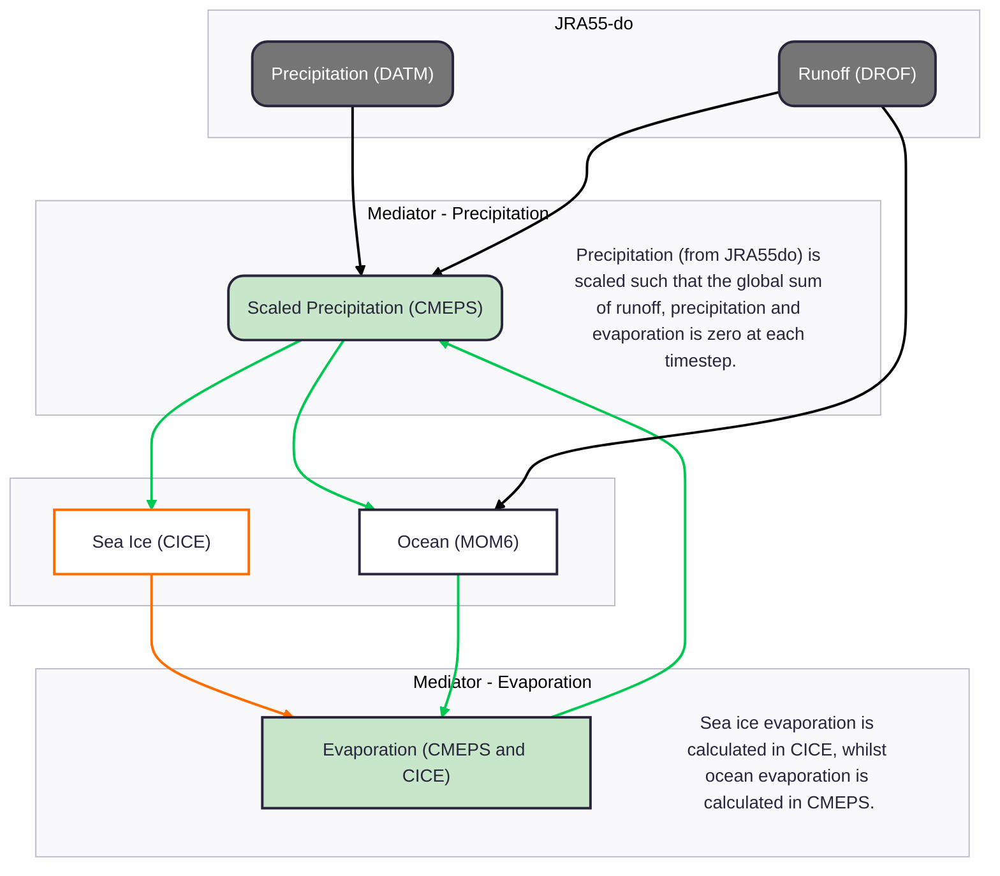

# Forcing

Forcing is provided via [CDEPS](https://github.com/ESCOMP/CDEPS) data models [documented here](https://escomp.github.io/CDEPS/versions/master/html/index.html), in particular

- [DATM](https://escomp.github.io/CDEPS/versions/master/html/datm.html) for the atmosphere
- [DROF](https://escomp.github.io/CDEPS/versions/master/html/drof.html) for runoff

This page covers forcings for the physical climate (e.g. temeperatures, winds, freshwater etc) and doesn't cover biogeochemical (BGC)  forcings (dust, CO2 etc) used in configurations using the BGC model, WOMBAT.

## Coupling

- DATM and DROF are coupled to the other components via the mediator - see the [coupling architecture here](/infrastructure/Architecture.md).
- The coupled fields and remapping methods used are recorded in the mediator log output file and can be found with `grep '^ mapping' archive/output000/log/med.log`; see [here](https://escomp.github.io/CMEPS/versions/master/html/esmflds.html) for how to decode this.
- See [the Configurations Overview page](/configurations/Overview.md#coupling) for details on how the coupling is determined.

## Input data

[JRA55do v1.6](https://climate.mri-jma.go.jp/pub/ocean/JRA55-do/), [replicated by NCI](https://dx.doi.org/10.25914/AT4E-Q668), is used as input data for DATM and DROF, following convention used in OMIP2 and drafted for OMIP3. For interannual-forcing (IAF) experiments, this data is available from 1958 until January 2024. For repeat-year-forcing (RYF) experiments, a single year of atmosphere and runoff data is selected (Jan-Apr 1991 and May-Dec 1990) using the `make_ryf.py` script in [om3-scripts](https://github.com/ACCESS-NRI/om3-scripts/blob/main/make_ryf/make_ryf.py) to generate the input files. This input data is repeated to produce the same input forcing in every model year. _Stewart et al._ (2020) describe the selected 12-month period to be one of the most neutral across the major climate modes of variability and less affected by the anthropogenic warming found in later years of the dataset. The paper does however remind us that the resulting model is an idealised numerical experiment and not a representation of long-term climatology.

[`datm.streams.xml`](https://github.com/ACCESS-NRI/access-om3-configs/blob/dev-MC_100km_jra_ryf/datm.streams.xml) and [`drof.streams.xml`](https://github.com/ACCESS-NRI/access-om3-configs/blob/dev-MC_100km_jra_ryf/drof.streams.xml) set individual input file paths for DATM and DROF respectively, relative to [this entry](https://github.com/search?q=repo%3AACCESS-NRI%2Faccess-om3-configs+path%3Adoc%2Fconfig.yaml+%22RYF%2Fv%22&type=code) in the `input` section of [`config.yaml`](https://github.com/ACCESS-NRI/access-om3-configs/blob/dev-MC_100km_jra_ryf/config.yaml) (see [the Configurations Overview page](/configurations/Overview.md#forcing-data)). These stream files also set time and spatial interpolation, time axes and ranges.

### Atmosphere

JRA55-do atmosphere provides **3-hourly instantenous**:

- sea level pressure;
- 10m wind velocity components;
- 10m specific humidity;
- 10m air temperature.

and **3-hourly averaged**:

- liquid and solid precipitation;
- downwelling surface long-wave and shortwave radiation. 

Input data is first interpolated to the model time within DATM, second remapped from DATM to the mediator, and lastly copied from the mediator to the ocean (MOM6) and sea ice (CICE6). The first step uses linear interpolation in time (except for downwelling shortwave, which uses "coszen" interpolation in time - _cosine of the solar zenith angle_). The second step remaps from the source grid (~55km resolution) to the access-om3 grid. For fluxes (precipitation and radiation), conservative remapping is applied, whilst patch remapping is used for everything else (temperature, humidity, wind). Weights for this second step are calculated during model initialisation. The third stage moves data from mediator to the ocean and sea ice model components. The mediator and active model components are on the same grid, so the only operation in the third stage is to distribute fluxes to model components by scaling fluxes using the sea ice fraction, where required. For atmosphere forcing, the landmask is applied simply as a true/false mask, as access-om3 does not have partial ocean cells. Therefore only atmosphere data over the ocean are input as forcings.

### Runoff

JRA55-do runoff provides daily mean liquid and frozen runoff fields, although the runoff at many locations in the dataset is updated less frequently than daily. In the source data, all frozen run-off is distributed at the ocean surface of the Antarctic/Greenland coastlines without spreading (see issue [#404](https://github.com/ACCESS-NRI/access-om3-configs/issues/404)). 

Similar to atmospheric forcing, runoff data is first interpolated in time, second remapped from DROF to the mediator, and lastly from the mediator the the ocean (MOM6). The first and second mapping step is similar to the atmospheric forcing, namely using linear interpolation in time and conservative interpolation spatially. The last stage remapping moves from the om3 grid without a landmask to the same grid with a landmask. For runoff, the differences in landmask between the incoming data on the JRA55-do grid and the OM3 grids can cause runoff to be remapped to land cells or on cells away from the coastlines. When runoff would be placed on land cells or non-coastal ocean cells, the volume of runoff is crudely moved to the nearest coastal ocean cell using pre-generated weights from the [generate_rof_weights.py](https://github.com/ACCESS-NRI/om3-scripts/blob/main/mesh_generation/generate_rof_weights.py) script. _generate_rof_weights.py_ selects the nearest coastal ocean cell by a BallTree algorithm using Haversine distances (i.e. the shortest disance on a sphere). The combined effect of the two remapping steps is that the full global volume of runoff enters the ocean, and only at cells which abut land cells.

## Ice surface wind stress

This is calculated in CICE6 (IcePack). The wind velocity, specific humidity, air density and potential temperature at the level height `zlvl` (with optionally a different height `zlvs` for scalars) are used to compute transfer coefficients used in formulas for the surface wind stress and turbulent heat fluxes.

The CICE6 forcing settings are in [namelist group `forcing_nml` in `cice_in`](https://github.com/search?q=repo%3AACCESS-NRI%2Faccess-om3-configs+path%3Adoc%2Fice_in+forcing_nml&type=code). Many are unspecified and therefore take the [default values](https://cice-consortium-cice.readthedocs.io/en/cice6.4.0/user_guide/ug_case_settings.html#forcing-nml).
We use the default [`atmbndy = 'similarity'`](https://cice-consortium-cice.readthedocs.io/en/cice6.4.0/user_guide/ug_case_settings.html?highlight=atmbndy#forcing-nml), which uses a [stability-based boundary layer parameterisation based on Monin-Obukhov theory](https://cice-consortium-icepack.readthedocs.io/en/main/science_guide/sg_boundary_forcing.html#atmosphere) following [Kauffman and Large (2002)](https://github.com/CICE-Consortium/CICE/blob/main/doc/PDF/KL_NCAR2002.pdf).
Because our ice-ocean coupling frequency resolves inertial oscillations we use the non-default option [`highfreq = .true.`](https://github.com/search?q=repo%3AACCESS-NRI%2Faccess-om3-configs+path%3Adoc%2Fice_in+highfreq&type=code) ([Roberts et al., 2015](https://dx.doi.org/10.3189/2015AoG69A760)), which uses the relative ice-atmosphere velocity to calculate the wind stress on the ice.
The exchange coefficients for momentum and scalars are determined iteratively, with a convergence tolerance `atmiter_conv` on `ustar` and maximum `natmiter` iterations. These take [default values](https://cice-consortium-cice.readthedocs.io/en/cice6.4.0/user_guide/ug_case_settings.html#forcing-nml) `atmiter_conv = 0.0` and `natmiter = 5`. We don't use [spatiotemporally variable form drag](https://cice-consortium-icepack.readthedocs.io/en/main/science_guide/sg_boundary_forcing.html#variable-exchange-coefficients) (`formdrag = .false`, the [default](https://cice-consortium-cice.readthedocs.io/en/cice6.4.0/user_guide/ug_case_settings.html#forcing-nml)).

## Ocean surface stress

Ocean surface stress is a combination of wind stress and ice-ocean stress.
`Foxx_taux` and `Foxx_tauy` are the components of this combined surface stress [received by the MOM6 cap](https://github.com/ACCESS-NRI/MOM6/blob/776be843e904d85c7035ffa00233b962a03bfbb4/config_src/drivers/nuopc_cap/mom_cap_methods.F90#L149-L154), and are [calculated in the mediator](https://github.com/ESCOMP/CMEPS/blob/4b636c6f794ca02d854d15c620e26644751b449b/mediator/esmFldsExchange_cesm_mod.F90#L2242-L2274).
`Foxx_taux` is a weighted sum of `Fioi_taux` (the ice-ocean stress) and `Faox_taux` (the atmosphere-ocean stress), weighted by the fraction of ice and open ocean in each cell. Similarly, `Foxx_tauy` is a weighted sum of `Fioi_tauy` and `Faox_tauy`. The prefix `Foxx` denotes an ocean (`o`) - mediator (`x`) flux (`F`) calculated by the mediator (`x`). Similarly `Fioi` denotes an ice (`i`) - ocean flux calculated by the ice component, and `Faox` indicates an atmosphere (`a`) - ocean flux calculated by the mediator (see [here](https://escomp.github.io/CMEPS/versions/master/html/esmflds.html) for details on this notation).
Thus `Fioi_taux` is calculated in CICE6, whereas `Faox_taux` is calculated in the mediator (similarly for the y components).

### Ice-ocean stress

The ice-ocean stress components `Fioi_taux` and `Fioi_tauy` are calculated in CICE6.
`Fioi_taux` and `Fioi_tauy` are [mapped from `tauxo` and `tauyo` in the CICE6 cap](https://github.com/ACCESS-NRI/CICE/blob/e68e05b7962fc926c8a35397bca464d6b1e06ab9/cicecore/drivers/nuopc/cmeps/ice_import_export.F90#L1253-L1261), which are in turn [calculated in the CICE6 cap from `strocnxT_iavg` and `strocnyT_iavg`](https://github.com/ACCESS-NRI/CICE/blob/e68e05b7962fc926c8a35397bca464d6b1e06ab9/cicecore/drivers/nuopc/cmeps/ice_import_export.F90#L1011-L1014), which are per-ice-area quantities at T points [calculated from per-cell-area stresses at U points `strocnxU` and `strocnyU`](https://github.com/ACCESS-NRI/CICE/blob/e68e05b7962fc926c8a35397bca464d6b1e06ab9/cicecore/cicedyn/general/ice_step_mod.F90#L977-L1007).
`strocnxU` and `strocnyU` are calculated by [subtroutine `dyn_finish`](https://github.com/ACCESS-NRI/CICE/blob/e68e05b7962fc926c8a35397bca464d6b1e06ab9/cicecore/cicedyn/dynamics/ice_dyn_evp.F90#L1384-L1398) using [this code](https://github.com/ACCESS-NRI/CICE/blob/e68e05b7962fc926c8a35397bca464d6b1e06ab9/cicecore/cicedyn/dynamics/ice_dyn_shared.F90#L1291-L1316); see [equation (4) here](https://cice-consortium-cice.readthedocs.io/en/main/science_guide/sg_coupling.html#equation-tauw) and [equation (2) here](https://cice-consortium-cice.readthedocs.io/en/cice6.4.0/science_guide/sg_dynamics.html) for an explanation. We use a turning angle $\theta=0$ (`cosw = 1.0`, `sinw = 0.0`, the [defaults](https://cice-consortium-cice.readthedocs.io/en/main/cice_index.html)), which is appropriate for an ocean component with vertical resolution sufficient to resolve the surface Ekman layer. We don't use [spatiotemporally variable form drag](https://cice-consortium-icepack.readthedocs.io/en/main/science_guide/sg_boundary_forcing.html#variable-exchange-coefficients) (`formdrag = .false`, the [default](https://cice-consortium-cice.readthedocs.io/en/cice6.4.0/user_guide/ug_case_settings.html#forcing-nml)).

**TODO: what namelist controls the ice-ocean stress calculation?**  

### Atmosphere-ocean stress
The atmosphere-ocean stress components `Faox_taux` and `Faox_tauy` are [calculated in the mediator](https://github.com/ESCOMP/CMEPS/blob/bc29792d76c16911046dbbfcfc7f4c3ae89a6f00/cesm/flux_atmocn/shr_flux_mod.F90#L434-L438).
We calculate `Faox_taux` and `Faox_tauy` using [`ocn_surface_flux_scheme = 0`](https://github.com/search?q=repo%3AACCESS-NRI%2Faccess-om3-configs+path%3Adoc%2Fnuopc.runconfig+ocn_surface_flux_scheme&type=code) in `nuopc.runconfig`, which is the [default CESM1.2 scheme](https://github.com/ESCOMP/CMEPS/blob/bc29792d76c16911046dbbfcfc7f4c3ae89a6f00/cesm/flux_atmocn/shr_flux_mod.F90#L335-L506).
This [iterates towards convergence of `ustar`](https://github.com/ESCOMP/CMEPS/blob/bc29792d76c16911046dbbfcfc7f4c3ae89a6f00/cesm/flux_atmocn/shr_flux_mod.F90#L393) to a relative error of less than [`flux_convergence = 0.01`](https://github.com/search?q=repo%3AACCESS-NRI%2Faccess-om3-configs+path%3Adoc%2Fnuopc.runconfig+flux_convergence&type=code), if this can be achieved in [`flux_max_iteration = 5`](https://github.com/search?q=repo%3AACCESS-NRI%2Faccess-om3-configs+path%3Adoc%2Fnuopc.runconfig+flux_max_iteration&type=code) iterations or fewer. The atmosphere-ocean stress is [calculated using the relative wind](https://github.com/ESCOMP/CMEPS/blob/bc29792d76c16911046dbbfcfc7f4c3ae89a6f00/cesm/flux_atmocn/shr_flux_mod.F90#L434-L438), i.e. the difference between the surface wind and surface current velocity.

## Surface fluxes

### Salt fluxes

The net salt flux across the ocean's surface is given by the `salt_flux` diagnostic. Salt fluxes are associated with two different processes:

1. Salt fluxes from sea ice, captured by the `salt_flux_in` diagnostic in MOM6 and the `fsalt` diagnostic in CICE.
2. Salt fluxes from sea surface salinity restoring, captured by `salt_flux_added` (note that SSS restoring is applied as a salt (rather than freshwater) flux in ACCESS-OM3, because we set `SRESTORE_AS_SFLUX = True` in the `MOM_input` file).

### Freshwater fluxes

Freshwater fluxes with the data models (DATM and DROF) are separated in ocean, sea ice and land components as follows. 

- **Precipitation:** precipitation over ocean and sea ice cells are scaled by the sea ice concentration in that cell. Therefore where sea ice covers part of a grid cell, a fraction of precipitation is received by each of the ocean and sea ice components, according to the sea ice concentration in that cell. Precipitation over land is discarded. Precipitation is secondly scaled such that the global freshwater going into the ocean and sea ice system is zero, see [Global Freshwater Balance](#global-freshwater-balance).
- **Evaporation:** evaporation (including sublimation, condensation and deposition) is calculated internally by CICE for sea ice. The mediator (CMEPS) calculates evaporation for the ocean and provides this as a surface forcing to MOM6.
- **Runoff:** runoff only enters the ocean. Therefore 100% of the runoff from DROF goes into MOM6.

The net freshwater flux across the ocean (MOM6) surface is given by the `wfo` diagnostic (sometimes the native MOM name `PRCmE` is used). Freshwater fluxes are associated with five different processes:

1. Total precipitation, captured by the `precip` diagnostic. This is the sum of liquid precipitation `lprec` and frozen precipitation `fprec`.
2. Evaporation, captured by `evap`.
3. Liquid runoff, captured by `lrunoff` or `friver`
4. Frozen runoff, captured by `frunoff` or `ficeberg`
5. Sea ice melt/formation, captured by `seaice_melt` (same as the CICE diagnostic `fresh`)

There are also two other summarising diagnostics, `net_massin` and `net_massout` which contain the net mass of freshwater into and out of the ocean respectively. Note that these are made up of a combination of the individual fluxes described above, but that `seaice_melt` contributes to both depending on whether ice is formed or melted.

The net freshwater flux across the sea ice (CICE) top surface is the sum of:

1. Precipitation: captured by `rain_ai` and `snow_ai`
2. Evaporation: captured by `evap_ai`.

and the net freshwater flux across the sea ice - ocean interface is `fresh` (MOM6 diagnostic `seaice_melt`).

#### Global Freshwater Balance

For global model configurations, incoming precipitation is scaled such that the global volume of freshwater entering the ocean and sea ice total system is zero.
As the evaporation parameterisations used in the active model components are not consistent with those used in atmosphere and runoff forcing data (JRA55do), 
a correction is applied to incoming precipitation to prevent drift in the total ocean and sea ice mass. 
The scaling is applied such that the global sum of runoff, precipitation and evaporation is zero. 
In this paragraph and diagram below:
- evaporation includes evaporation, condensation, deposition and sublimation;
- precipitation includes rain and snow; and
- runoff includes both river and ice-sheet runoff.

The scaling is implemented by including [`med_phases_scalefreshwater_run`](https://github.com/ACCESS-NRI/CMEPS/blob/HEAD/mediator/med_phases_scalefluxes_mod.F90) in 
[`nuopc.runseq`](https://github.com/ACCESS-NRI/access-om3-configs/commit/200242fdce3c15fc97831d9aa7bdf43f81eb531c#diff-a38027e841650d12250f4828301a4a336a0a3170b80dfaa90ee370455ed36951) and setting the MOM6 option `ADJUST_NET_FRESH_WATER_TO_ZERO` to False

### Heat fluxes

Heat fluxes with the data models (DATM and DROF) are seperated in ocean, sea ice and land components as follows. 

- **Radiation:** incoming shortwave from the atmosphere, over ocean and sea ice cells, are scaled by the sea ice concentration in that cell. Therefore where sea ice covers part of a grid cell, a fraction of shortwave is received by each of the ocean and sea ice components, according to the sea ice concentration in that cell. A small fraction of incomings shortwave penetrates through sea ice to enter the ocean. 
- **Sensible Heat :** Sensible heat fluxes are calculated internally by CICE for sea ice. The mediator (CMEPS) calculates these for the ocean and provides this as a surface forcing to MOM6.
- **Latent Heat (Evaporation):** Latent heat due to evaporation are calculated internally by CICE for sea ice. The mediator (CMEPS) calculates these for the ocean and provides this as a surface forcing to MOM6.
- **Latent Heat (Melt):** The latent heat to melt frozen runoff (i.e. icebergs) is calculated internally in MOM6.
- **Heat from mass transfer:** The enthalpy transferred in/out of the ocean due to freshwater transfer is calculated in the mediator (CMEPS) and provided as a surface forcing to MOM6. For CICE6, this enthalpy flux is calculated internally.
- **Precipitation and Runoff:** Heat fluxes associated with transfer of freshwater are calculated in the relevant model components, for both MOM6 and CICE, based on the freshwater received by that component.

There is no prognostic process to raise/lower the temperature of freshwater fluxes to the ocean / sea ice temperature. It is assumed to enter the model at the temperature of the surrounding ocean / sea ice. There is also no process (currently) to account for latent heat to melt liquid runoff from icesheets (i.e. basal melt) - see [1197](https://github.com/ACCESS-NRI/access-om3-configs/issues/1197) for details.

The net heat flux across the ocean's surface is given by the `hfds` diagnostic (or native MOM name `net_heat_surface`). Heat fluxes are associated to eight different processes:

1. Shortwave radiation, captured by `rsntds` (or native MOM name `SW`)
2. Longwave radiation, captured by `rlntds` (or native MOM name `LW`)
3. Latent heat, captured by `hflso` (or native MOM name `latent`). This is the sum of latent heat from evaporation `latent_evap`, latent heat from frozen precipitation `hfsnthermds` (or native MOM name `latent_fprec_diag`), latent heat from frozen runoff `hfibthermds` (or native MOM name `latent_frunoff`) and latent heat from frozen runoff from glaciers `latent_frunoff_glc` (which is zero in ACCESS-OM3, since we don't couple to an active ice sheet model).
4. Sensible heat, captured by `hfsso` (or native MOM name `sensible`)
5. Heat from melt/freezing of sea ice, captured by `seaice_melt_heat` (same as CICE diagnostic `fhocn_ai`)
6. Heat from frazil formation, captured by `hfsifrazil` (or native MOM name `frazil`)
7. Heat from mass transfer, frozen or liquid, given by `heat_content_surfwater`, which can be further partitioned into:
      - `heat_content_evap`, from evaporation
      - `hfrainds`, from liquid and frozen precipitation and condensation, further split into `heat_content_lprec`, `heat_content_fprec` and `heat_content_cond`
      - `hfrunoffds` from liquid and frozen runoff, further split into `heat_content_lrunoff`, `heat_content_frunoff`, `heat_content_lrunoff_glc` and `heat_content_frunoff_glc` (again, the `_glc` components are zero in ACCESS-OM3)
8. Heat from flux adjustments, captured by `heat_added` (zero in ACCESS-OM3).

Note that the diagnostic `net_heat_coupler` includes processes 1. to 5., but _not_ 6., 7. or 8.

## References

K.D. Stewart, W.M. Kim, S. Urakawa, A.McC. Hogg, S. Yeager, H. Tsujino, H. Nakano, A.E. Kiss, G. Danabasoglu,
JRA55-do-based repeat year forcing datasets for driving ocean–sea-ice models,
Ocean Modelling,
Volume 147,
2020,
https://doi.org/10.1016/j.ocemod.2019.101557.
